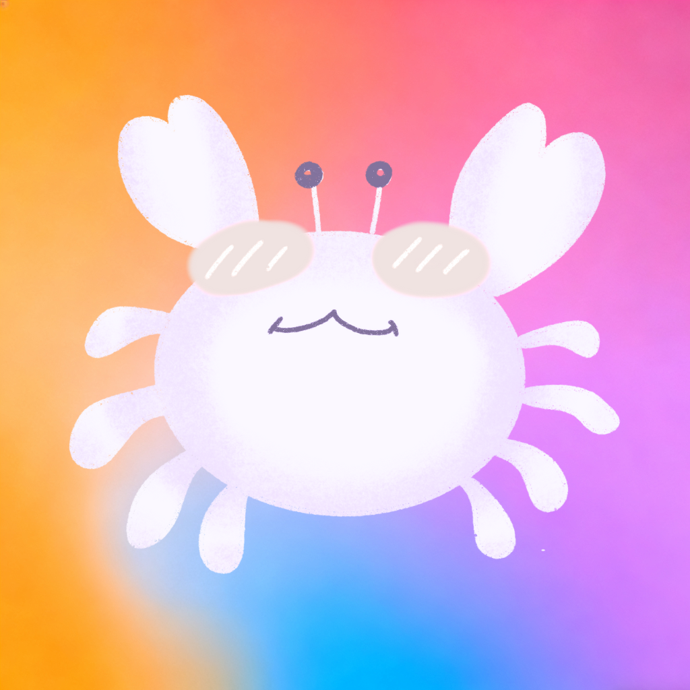

# Moltbot-ios APP
<p align="center">
  
</p>

<h1 align="center">MoltBot iOS Third‑Party Client</h1>

<p align="center">
  Built on <strong>MoltBot/Clawbot</strong> · TestFlight Public Beta
</p>

<p align="center">
  <a href="#en">English</a> · <a href="#zh">中文</a>
</p>

---

<a id="en"></a>

## TestFlight Public Beta

https://testflight.apple.com/join/jy2cVjRX

## Overview

This is a third‑party iOS client based on **MoltBot/Clawbot**. It is currently available via TestFlight public beta, with the App Store release in preparation.

## Features

- **Voice Input** — Speak naturally to your Clawdbot
- **Neural TTS** — High‑quality voice responses via Kokoro TTS
- **Device Capabilities** — Camera, location, and notifications exposed as agent tools
- **Session History** — Full conversation sync across devices

## Requirements

- iOS 18.0+
- Clawdbot gateway running and accessible
- VPN connection to your home network (if accessing remotely)

## Setup & Pairing

### 1. Configure Gateway Connection

In Clawdy Settings, enter:

- **Gateway Host**: Your Clawdbot server IP/hostname
- **Gateway Port**: 18789 (default)
- **Gateway Token**: Your gateway authentication token

### 2. Pair the Device

On your Clawdbot server, run these commands to allow Clawdy to connect:

```
# List pending/available devices
clawdbot devices list

# Allow the device for chat (operator role)
clawdbot devices allow <device-id>

# Allow the device for node capabilities (node role)
clawdbot devices allow <device-id>
```

Run the `allow` command twice — once grants **operator** role (chat), once grants **node** role (camera/location/notifications).

### 3. Connect

Back in Clawdy, tap **Test Connection** or simply start the app — it will auto‑connect.

## Troubleshooting

### "Gateway auth token" error

If you see an authentication error when connecting:

1. Open Clawdy Settings
2. Copy your Gateway Token value
3. Paste it into the **Remote Token** field as well
4. Try connecting again

### Connection drops frequently

- Ensure your VPN connection is stable
- Check that the Clawdbot gateway is running: `clawdbot gateway status`
- Restart the gateway if needed: `clawdbot gateway restart`

### Camera/Location not working

- Ensure you've granted Clawdy the necessary iOS permissions
- Check that the device has **node** role: `clawdbot devices list`
- Node capabilities only work when the app is in foreground

## Credits

Special thanks to the open‑source project **Clawdy**:
https://github.com/chrisherold/clawdy

---

<a id="zh"></a>

## TestFlight 公开测试

https://testflight.apple.com/join/jy2cVjRX

## 概览

这是一个基于 **MoltBot/Clawbot** 的第三方 iOS 客户端，当前通过 TestFlight 公开测试，正式版正在准备上架 App Store。

## 功能特性

- **语音输入** — 可直接对 Clawdbot 自然说话
- **神经 TTS** — 基于 Kokoro TTS 的高质量语音回复
- **设备能力** — 相机、定位与通知作为 Agent 工具可用
- **会话同步** — 多设备完整对话历史同步

## 使用要求

- iOS 18.0+
- Clawdbot 网关服务已运行且可访问
- 远程访问时需连接回家里的 VPN

## 配置与配对

### 1. 配置网关连接

在 Clawdy 设置中填写：

- **Gateway Host**：你的 Clawdbot 服务器 IP/域名
- **Gateway Port**：18789（默认）
- **Gateway Token**：网关认证 Token

### 2. 设备配对

在 Clawdbot 服务器上执行以下命令允许连接：

```
# 列出待授权/可用设备
clawdbot devices list

# 允许聊天角色（operator）
clawdbot devices allow <device-id>

# 允许设备能力（node）
clawdbot devices allow <device-id>
```

`allow` 需要执行两次——一次授予 **operator**（聊天），一次授予 **node**（相机/定位/通知）。

### 3. 连接

回到 Clawdy 点击 **Test Connection**，或直接启动 App，系统会自动连接。

## 故障排除

### “Gateway auth token” 错误

如果连接时报认证错误：

1. 打开 Clawdy 设置
2. 复制 Gateway Token
3. 也粘贴到 **Remote Token** 字段
4. 重试连接

### 连接频繁断开

- 确保 VPN 连接稳定
- 检查网关是否运行：`clawdbot gateway status`
- 必要时重启网关：`clawdbot gateway restart`

### 相机/定位不可用

- 确认已授予 Clawdy 相关 iOS 权限
- 确认设备具有 **node** 角色：`clawdbot devices list`
- Node 能力仅在 App 前台运行时可用

## 致谢

特别感谢开源项目 **Clawdy**：
https://github.com/chrisherold/clawdy
